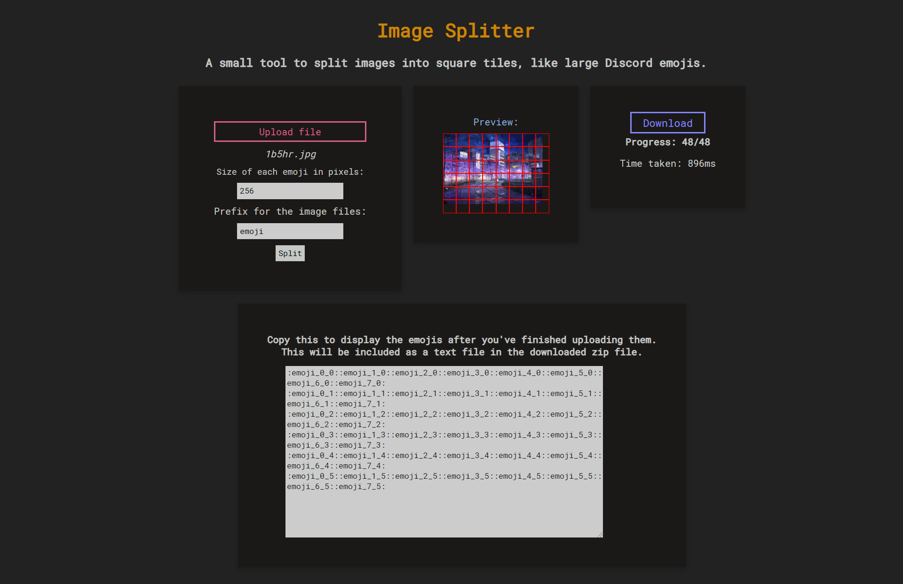
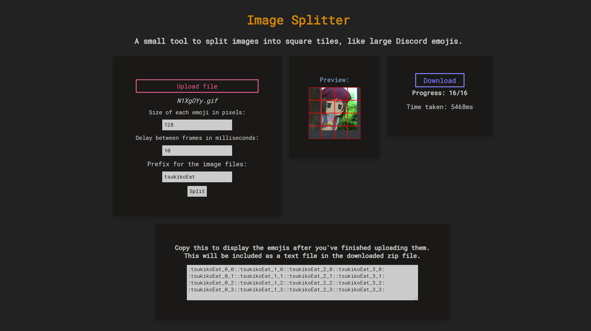

## Image Splitter
A tool to split an image into square tiles. Supports gifs.

Upload an image, and it will save the square tiles into a zip file. If there are more than 50 tiles, it will separate them into different folders.

You can adjust the size of the square tiles, the prefix of the image files, and the delay in milliseconds between the frames of the gif (if applicable).

## Examples

 Still Image: 

 Animated Gif: 

## Libraries Used
A big thanks to the creators of these libraries for their work. Without them, this project would not have been possible.
- FileSaver by eligrey: https://github.com/eligrey/FileSaver.js/
- gif.js by jnordberg: https://jnordberg.github.io/gif.js/
- JSZip by Stuk: https://stuk.github.io/jszip/
